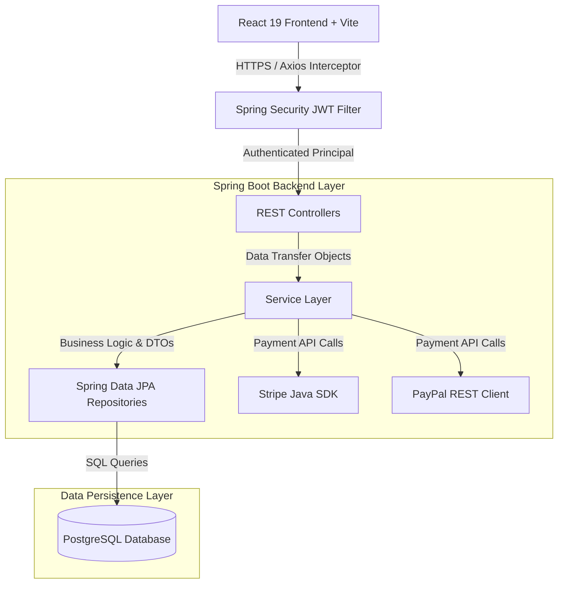

# ShopVerse - Premium Full-Stack E-Commerce Platform

A production-grade, multi-user E-Commerce platform designed to deliver a seamless shopping experience for customers while offering robust catalog management, order fulfillment, and analytics tools for sellers and system administrators. The stack combines a resilient **Spring Boot REST API backend** with a modern, responsive **React + Redux Toolkit frontend interface**.

---

## 🌐 Live Demo & Preview

- **Backend API Server**: `http://localhost:8080` (Spring Boot REST Web Services)
- **Frontend App**: `http://localhost:5173` (React 19 + Vite)
- **API Documentation**: `http://localhost:8080/swagger-ui.html` (SpringDoc OpenAPI UI)

---

## 📖 Table of Contents

1. [Problem Solved & Project Description](#1-problem-solved--project-description)
2. [Key Features](#2-key-features)
3. [How Project is Implemented](#3-how-project-is-implemented)
4. [System Architecture](#4-system-architecture)
5. [Technical Stack](#5-technical-stack)
6. [Control Flow](#6-control-flow)
7. [List of All API Endpoints](#7-list-of-all-api-endpoints)
8. [How Payment is Integrated](#8-how-payment-is-integrated)
9. [Complete Control Flow & Setup Guide](#9-complete-control-flow--setup-guide)

---

## 1. Problem Solved & Project Description

### The Problem
Traditional e-commerce implementations often struggle with:
- **Data Isolation Leaks**: Shared cart states or address records leaking across different user accounts.
- **Payment Gateway Instability**: Rigid single-payment options failing when payment services undergo outages.
- **Audit Breakage on Deletes**: Deleting user addresses crashing order histories due to broken database foreign keys.
- **Complex Inventory Synchronization**: Race conditions or out-of-stock orders placed due to non-atomic inventory tracking.

### The Solution: ShopVerse
**ShopVerse** addresses these industry challenges through a clean, decoupled architecture:
- **User-Isolated Resource Scoping**: All cart logs, address entities, and checkout flows are strictly bounded to authenticated JWT user identities.
- **Dual Payment Redundancy**: Seamlessly switch between **Stripe** (Credit/Debit Card payments via PaymentIntents) and **PayPal** (Express Checkout Sandbox).
- **Audit-Safe Deletion Mechanics**: Address deletions disassociate active user links without breaking past order audit trails.
- **Role-Based Workflows**: Tailored user interfaces for **Customers** (storefront & checkout), **Sellers** (inventory & store order management), and **Admins** (system-wide user roles, categories, and sales analytics).

---

## 2. Key Features

### 🔐 Multi-User Security & Authentication
- **Role-Based Access Control (RBAC)**: Supports `ROLE_USER`, `ROLE_SELLER`, and `ROLE_ADMIN`.
- **JWT Authentication**: Secure login issuing signed JSON Web Tokens stored via HTTP-only cookies and Authorization header interceptors.
- **User Profile Management**: Account profile overview, saved shipping addresses, and personal order tracking.

### 🛍️ Product Catalog & Inventory
- **Dynamic Search & Filtering**: Real-time product search by keyword, category filtering, and paginated catalog browsing.
- **Stock Management**: Live stock checking prevents users from adding items beyond available quantities.
- **Image Upload System**: Multipart file upload support for custom product images served directly via backend static handlers.

### 🛒 User-Isolated Cart System
- **State Synchronization**: Backend persistent cart mapping paired with Redux state management.
- **Coupon Code Engine**: Support for discount codes (e.g., `SHOP10` for 10% off, `SAVE20` for 20% off).
- **Session Purging**: Logging out purges local cart storage, preventing data leakage across shared browser sessions.

### 🚚 Shipping Address Management
- **Address Selection**: Save multiple delivery addresses (street, building, city, state, country, pincode).
- **Default Checkout Selection**: One-click address selection during checkout.
- **Foreign Key Safe Deletion**: Deleting saved addresses unlinks user records while preserving historical order logs.

### 💳 Dual Payment Gateway Integration
- **Stripe Payment Elements**: Secure credit/debit card processing using Stripe `PaymentIntent` API.
- **PayPal Express Checkout**: Native PayPal SDK integration for instant sandbox wallet payments.

### 📊 Admin & Seller Dashboards
- **Seller Portal**: Manage product inventory, upload product images, track customer orders, and update shipping statuses (`Pending`, `Processing`, `Delivered`).
- **Admin Console**: Full access to global sales analytics, seller user creation, category management, and site-wide order oversight.

---

## 3. How Project is Implemented

### Backend Implementation (Spring Boot)
- **Controller Layer**: Exposes REST endpoints, validates incoming payloads using `@Valid`, and delegates business logic.
- **Service Layer**: Contains core business logic, transactional boundaries (`@Transactional`), and entity mapping.
- **Repository Layer**: Extends `JpaRepository` for Spring Data JPA query execution against PostgreSQL.
- **Security Filter**: Intercepts requests, parses JWT tokens, verifies signatures, and sets SecurityContext authentication.
- **DTO Mapping**: Uses `ModelMapper` to decouple internal database JPA entities from external API request/response payloads.

### Frontend Implementation (React 19 + Vite)
- **State Management**: Redux Toolkit manages global states for products, categories, cart items, user auth, address selection, and payment flows.
- **API Interceptor**: Axios instance configured with `withCredentials: true` and request interceptors to automatically append JWT bearer tokens.
- **UI Framework**: TailwindCSS v4 paired with Material-UI components (Stepper, Badges, Modals) for modern glassmorphic aesthetics.
- **Notifications**: React Hot Toast provides real-time user feedback on actions (cart additions, address saves, errors).

---

## 4. System Architecture



---

## 5. Technical Stack

| Category | Technologies / Libraries Used |
| :--- | :--- |
| **Java JDK & Framework** | JDK 21, Spring Boot `v3.4.2` |
| **Backend Web & Security** | Spring Web, Spring Security, JJWT `v0.13.0` |
| **Data & ORM** | Spring Data JPA, Hibernate, PostgreSQL, ModelMapper `v3.0.0`, Lombok |
| **Payment SDKs** | Stripe Java SDK `v29.3.0`, PayPal Sandbox REST API |
| **Frontend Core** | React `v19.2.3`, Vite `v7.3.1`, React Router DOM `v7.12.0` |
| **State Management** | Redux Toolkit `@reduxjs/toolkit` `v2.11.2`, React Redux `v9.2.0` |
| **Styling & UI** | TailwindCSS `v4.1.18`, Material-UI `@mui/material` `v7.3.7`, React Icons `v5.5.0` |
| **HTTP & Alerts** | Axios `v1.13.2`, React Hot Toast `v2.6.0` |

---

## 6. Control Flow

```
[ User Browses Storefront ] ➔ [ Adds Products to Cart ] ➔ [ Navigates to Checkout ]
                                                                   │
                                                                   ▼
[ Selects Shipping Address ] ➔ [ Chooses Payment Method (Stripe / PayPal) ]
                                                                   │
                                                                   ▼
[ Executes Payment Gateway Charge ] ➔ [ Server Verifies Payment & Creates Order ]
                                                                   │
                                                                   ▼
[ Order Logged & Cart Cleared ] ➔ [ Seller/Admin Fulfills Order Status ]
```

1. **User Authentication**: User registers or logs in via `/api/auth/signin`. Server validates credentials and returns a JWT token.
2. **Catalog Browsing**: User requests `/api/public/products`. Products load with price, category, and stock indicators.
3. **Cart Operations**: User adds products to cart. State updates locally and syncs with backend via `/api/cart/create` or `/api/carts/products/{id}/quantity/{qty}`.
4. **Checkout & Address Selection**: User enters `/checkout`. Addresses load from `/api/users/addresses`. User selects or adds a delivery address.
5. **Payment Gateway Authorization**:
   - **Stripe**: Frontend requests `/api/order/stripe-client-secret`. Backend creates a Stripe `PaymentIntent` and returns `clientSecret`. Frontend mounts Stripe `PaymentElement` to complete the transaction.
   - **PayPal**: Frontend mounts PayPal Express buttons. Upon completion, approval payload is posted to backend.
6. **Order Placement**: Request sent to `/api/order/users/payments/{paymentMethod}`. Backend updates inventory, builds `Order` & `OrderItem` records, clears cart, and confirms transaction.
7. **Fulfillment**: Sellers and Admins view new orders in dashboard and update status from `Pending` ➔ `Processing` ➔ `Delivered`.

---

## 7. List of All API Endpoints

### 🔑 Authentication APIs
| Endpoint | Method | Description | Access |
| :--- | :--- | :--- | :--- |
| `/api/auth/signup` | `POST` | Register a new user account | Public |
| `/api/auth/signin` | `POST` | Authenticate user and issue JWT cookie/token | Public |
| `/api/auth/signout` | `POST` | Invalidate session and clear auth cookie | Authenticated |
| `/api/auth/user` | `GET` | Retrieve logged-in user profile details | Authenticated |
| `/api/auth/username` | `GET` | Fetch current user name | Authenticated |
| `/api/auth/sellers` | `GET` | List seller accounts (paginated) | Admin |
| `/api/auth/sellers/{sellerId}` | `PUT` | Update seller account parameters | Admin |

### 🏷️ Category APIs
| Endpoint | Method | Description | Access |
| :--- | :--- | :--- | :--- |
| `/api/public/categories` | `GET` | Retrieve paginated categories list | Public |
| `/api/admin/categories` | `POST` | Create a new product category | Admin / Seller |
| `/api/admin/categories/{categoryId}` | `PUT` | Edit an existing category | Admin / Seller |
| `/api/admin/categories/{categoryId}` | `DELETE` | Remove a category | Admin / Seller |

### 📦 Product APIs
| Endpoint | Method | Description | Access |
| :--- | :--- | :--- | :--- |
| `/api/public/products` | `GET` | Search and retrieve public product catalog | Public |
| `/api/public/categories/{categoryId}/products` | `GET` | Fetch products filtered by category | Public |
| `/api/public/products/keyword/{keyword}` | `GET` | Search products by title keyword | Public |
| `/api/admin/categories/{categoryId}/product` | `POST` | Add new product to category | Admin / Seller |
| `/api/seller/categories/{categoryId}/product` | `POST` | Add product as seller | Seller |
| `/api/admin/products/{productId}` | `PUT` | Update product details | Admin |
| `/api/seller/products/{productId}` | `PUT` | Update seller product details | Seller |
| `/api/admin/products/{productId}/image` | `PUT` | Upload product display image | Admin / Seller |
| `/api/admin/products/{productId}` | `DELETE` | Remove product entry | Admin |
| `/api/seller/products/{productId}` | `DELETE` | Remove seller product entry | Seller |

### 🛒 Shopping Cart APIs
| Endpoint | Method | Description | Access |
| :--- | :--- | :--- | :--- |
| `/api/carts/users/cart` | `GET` | Retrieve authenticated user's active cart | Authenticated |
| `/api/cart/create` | `POST` | Batch sync local cart items with backend | Authenticated |
| `/api/carts/products/{productId}/quantity/{quantity}` | `POST` | Add single product quantity to cart | Authenticated |
| `/api/cart/products/{productId}/quantity/{operation}` | `PUT` | Increment/Decrement product quantity in cart | Authenticated |
| `/api/carts/{cartId}/product/{productId}` | `DELETE` | Delete product item from cart | Authenticated |

### 📍 Address APIs
| Endpoint | Method | Description | Access |
| :--- | :--- | :--- | :--- |
| `/api/users/addresses` | `GET` | Retrieve logged-in user's shipping addresses | Authenticated |
| `/api/addresses` | `POST` | Save a new delivery address | Authenticated |
| `/api/addresses/{addressId}` | `GET` | Get address details by ID | Authenticated |
| `/api/addresses/{addressId}` | `PUT` | Update an address entry | Authenticated |
| `/api/addresses/{addressId}` | `DELETE` | Delete/disassociate an address safely | Authenticated |

### 💳 Order & Payment APIs
| Endpoint | Method | Description | Access |
| :--- | :--- | :--- | :--- |
| `/api/order/stripe-client-secret` | `POST` | Create Stripe `PaymentIntent` secret | Authenticated |
| `/api/order/users/payments/{paymentMethod}` | `POST` | Complete order with Stripe or PayPal | Authenticated |
| `/api/users/orders` | `GET` | View user order purchase history | Authenticated |
| `/api/admin/orders` | `GET` | View all global system orders | Admin |
| `/api/seller/orders` | `GET` | View orders placed for seller's products | Seller |
| `/api/admin/orders/{orderId}/status` | `PUT` | Update order shipment status | Admin |
| `/api/seller/orders/{orderId}/status` | `PUT` | Update seller order shipment status | Seller |
| `/api/admin/app/analytics` | `GET` | Fetch overall sales & order performance metrics | Admin |

---

## 8. How Payment is Integrated

### Stripe Payment Integration
1. **Payment Intent Creation**: When user reaches the final payment step, frontend calls `POST /api/order/stripe-client-secret` sending order total and currency (`usd`).
2. **Backend Processing**: `StripeServiceImpl` initializes a Stripe `PaymentIntent`:
   ```java
   PaymentIntentCreateParams params = PaymentIntentCreateParams.builder()
           .setAmount((long) (totalAmount * 100)) // Amount in cents
           .setCurrency("usd")
           .setAutomaticPaymentMethods(
                   PaymentIntentCreateParams.AutomaticPaymentMethods.builder()
                           .setEnabled(true)
                           .build()
           )
           .build();
   PaymentIntent intent = PaymentIntent.create(params);
   ```
3. **Client-Side Confirmation**: Frontend embeds Stripe's `<Elements stripe={stripePromise} options={{ clientSecret }}>` and mounts `<PaymentElement />`.
4. **Order Finalization**: Upon user payment approval by Stripe, frontend submits order details to `POST /api/order/users/payments/stripe`. The backend verifies payment state, records `Order` and `Payment` details in PostgreSQL, and clears the user's cart.

### PayPal Integration
1. **SDK Initialization**: Frontend embeds PayPal JavaScript SDK (`@paypal/react-paypal-js`) configured with sandbox `clientId`.
2. **Approval Handling**: Upon customer approving payment in the PayPal overlay:
   ```javascript
   onApprove: async (data, actions) => {
       const details = await actions.order.capture();
       // Send transaction details to backend order payment endpoint
       await dispatch(stripePaymentConfirmation({
           paymentMethod: "paypal",
           pgPaymentId: details.id,
           pgStatus: details.status
       }));
   }
   ```
3. **Backend Persistence**: Backend creates an order entry marked with `paymentMethod = "paypal"` and associates payment metadata with the customer's purchase record.

---

## 9. Complete Control Flow & Setup Guide

### 📂 File Structure Overview

```
ShopVerse-Ecommerce-Platform/
├── sb-ecom/                             # Spring Boot Backend Project
│   ├── src/main/java/com/ecommerce/project/
│   │   ├── config/                      # App Constants & OpenAPI configuration
│   │   ├── controller/                  # REST API Controllers (Auth, Product, Cart, Address, Order, Analytics)
│   │   ├── exceptions/                  # Custom Exception Handlers & Global Response Handlers
│   │   ├── model/                       # JPA Database Entities (User, Role, Product, Category, Cart, Address, Order)
│   │   ├── payload/                     # Request/Response DTOs
│   │   ├── repositories/                # Spring Data JPA Interfaces
│   │   ├── security/                    # Spring Security Configuration, JWT Filters & UserDetails Implementation
│   │   ├── service/                     # Service Implementations (Stripe, Order, Cart, Product, Address, Auth)
│   │   └── util/                        # Security Utilities (AuthUtil)
│   └── src/main/resources/
│       └── application.properties       # Database & API Secret Properties
│
├── ecom-frontend/                       # React 19 + Vite Frontend Application
│   ├── src/
│   │   ├── api/                         # Axios Client Instance & JWT Interceptors
│   │   ├── components/                  # Shared & Feature UI Components
│   │   │   ├── admin/                   # Admin & Seller Console Dashboards
│   │   │   ├── auth/                    # Login & Registration Pages
│   │   │   ├── cart/                    # Cart Management UI
│   │   │   ├── checkout/                # Checkout Wizard, Address Selector, Stripe & PayPal Payment Forms
│   │   │   ├── products/                # Catalog Display & Filtering
│   │   │   ├── profile/                 # User Profile & Address Manager
│   │   │   └── shared/                  # Navbar, Footer, Loading Skeletons, Modals
│   │   ├── store/                       # Redux Toolkit Store, Actions & Reducers
│   │   ├── utils/                       # Price Formatters & Currency Utility Functions
│   │   ├── App.jsx                      # App Routes & Layout Navigation
│   │   └── main.jsx                     # Entrypoint & Redux Provider Wrapper
│   ├── package.json
│   └── vite.config.js
│
├── database/                            # SQL Seed Scripts & Product Generators
│   ├── seed_600_products_unsplash.sql
│   ├── seed_600_products.sql
│   ├── seed_products.sql
│   └── generate_600_products.js
│
└── images/                              # Product Image Assets
```

---

## 🛠️ Step-by-Step Prerequisites & Setup Guide

### 1. Prerequisites
- **Java Development Kit (JDK 21)**
- **Apache Maven** (`v3.8+` or included `mvnw`)
- **Node.js** (`v18+` or `v20+`) & **npm**
- **PostgreSQL Database** Server running locally or in cloud

---

### 2. Database Backend Configuration
1. Open your PostgreSQL database client (e.g., pgAdmin, psql CLI) and create a database named `ecommerce`:
   ```sql
   CREATE DATABASE ecommerce;
   ```
2. Navigate to `sb-ecom/src/main/resources/application.properties` and verify/update your credentials:
   ```properties
   spring.datasource.url=jdbc:postgresql://localhost:5432/ecommerce
   spring.datasource.username=postgres
   spring.datasource.password=1210
   spring.jpa.hibernate.ddl-auto=update
   spring.jpa.database-platform=org.hibernate.dialect.PostgreSQLDialect

   # Stripe Credentials
   stripe.secret.key=your_stripe_secret_key

   # PayPal Sandbox Credentials
   paypal.client.id=your_paypal_client_id
   paypal.client.secret=your_paypal_client_secret
   paypal.mode=sandbox
   ```

---

### 3. Run the Spring Boot Backend Server
From the project root directory, run:
```bash
cd sb-ecom
./mvnw spring-boot:run
```
*(On Windows Command Prompt, use `mvnw.cmd spring-boot:run`)*

The server will start and listen for requests on **`http://localhost:8080`**.

---

### 4. Run the React Frontend Application
Open a second terminal window and navigate to `ecom-frontend`:
```bash
cd ecom-frontend
npm install
npm run dev
```

The Vite development server will boot up at **`http://localhost:5173`**. Open your web browser and navigate to `http://localhost:5173` to explore **ShopVerse**!

---

## 👨‍💻 Author & Maintainer
Created and maintained as a showcase full-stack Java Spring Boot + React E-Commerce application.
